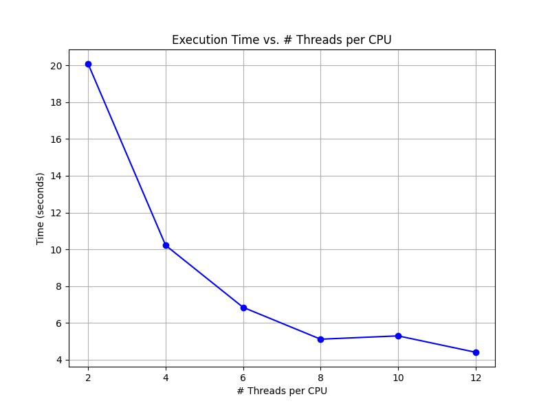
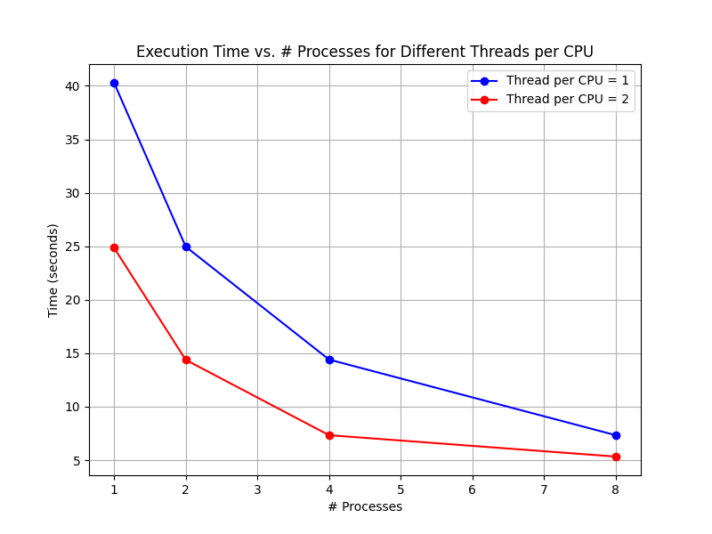

## Environment

## Run Code

## Plots: Scalability & Load Balancing & Profile
- Test Case: slow02 `54564 -0.34499 -0.34501 -0.61249 -0.61251 800 800`

- Performance Measurement: Time (Speedup)
    - Pthread
        
    - Hybrid
        

